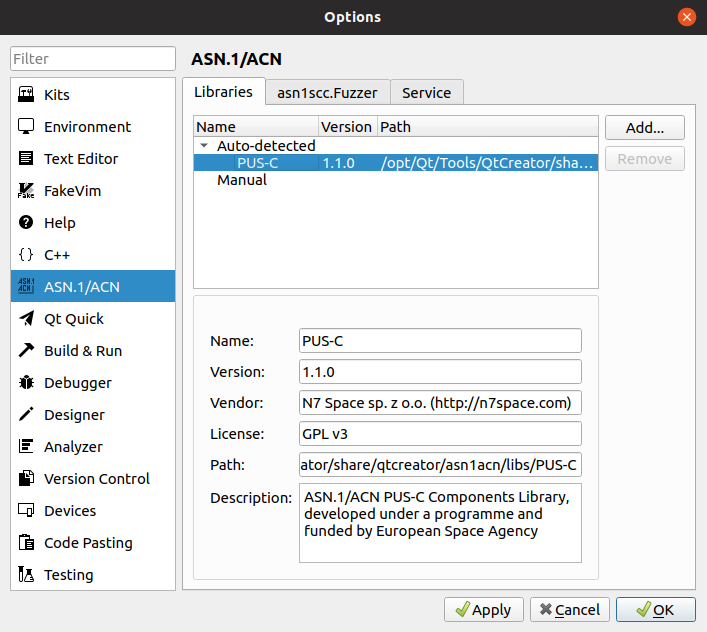
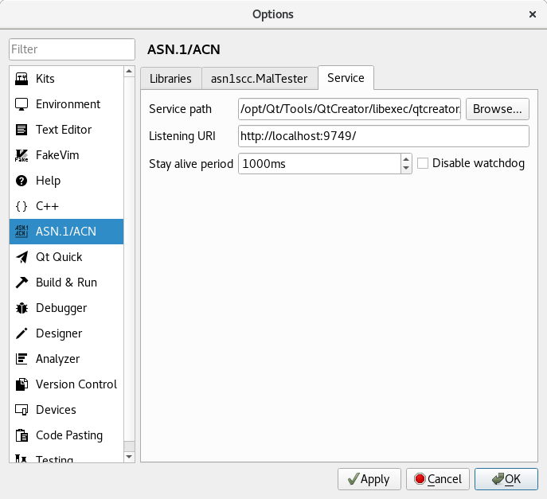

# Configuration

Plugin adds it's own set of parameters to Qt Creator's options (*Tools* -> *Options*).
Options are divided into categories, each is described below.

## Libraries
This option page list ASN.1 components libraries available for user as models' import sources.

Library is a folder tree containing ASN.1 and ACN files and optional additional JSON metadata.

Auto-detected libraries are the one found in Qt Creator installation directory:
 * default `/opt/Qt/Tools/QtCreator/share/qtcreator/asn1acn/libs` on Linux
 * default `C:\Qt\Tools\QtCreator\share\qtcreator\asn1acn\libs` on Windows
or in user's local settings:
 * `~/.config/QtProject/qtcreator/asn1acn/libs` on Linux
 * `%APPDATA%\QtProject\qtcreator\asn1acn\libs` on Windows
 
User can add own folders using `Add` button.

## asn1scc.MalTester
This page configures path to [asn1scc.MalTester](https://github.com/n7space/asn1scc.MalTester) tool, which can be used to generate test cases based on ASN.1 models.

## Service
Plugin relies on [ASN1SCC](https://github.com/ttsiodras/asn1scc) compiler to process ASN.1 files.
Plugin executes ASN1SCC in 'daemon' mode and communicates with it using local sockets.
Usually default settings should work for most users, as by default plugin executes compiler distributed with it, but user might want to use other version of compiler. Also socket-based communication might cause problems on some setups, so options on this page might need some tweaking (see [Troubleshooting](troubleshooting.html))

 * Service path - path to ASN1SCC Daemon executable.
 * Listening URI - URI on which daemon should listen for plugin requests, might needs change if default address is blocked for any reason.
 * Stay alive period - daemon will quit if no messages from plugin are recevied in provided period; used mostly for debugging.
 * Disable watchdog - daemon will no longer be restarted on lack of communication.