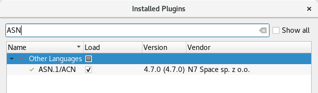

**asn1scc.IDE** is a [Qt Creator](https://www.qt.io/download) plugin for [ASN1SCC](https://github.com/ttsiodras/asn1scc) - ASN.1/ACN compiler for embedded systems.

Plugin was developed by [N7 Space](http://www.n7space.com) and funded by European Space Agency ([ESA](http://www.esa.int)) and is distributed under [GPL v3.0](https://www.gnu.org/licenses/gpl-3.0.html) license.

# Main features
 * Code highlighting, snippets, auto-completion and completion suggestions.
 * Support for ASN.1 and ACN files in QMake and CMake projects.
 * Outline view for ASN.1 files.
 * ASN.1 Types view for all models in project.
 * 'Find Usages' and 'Type locator' (Ctrl+K) for ASN.1 types.

# Requirements
 * OS supported by Qt Creator (plugin was tested on Debian 9 and Windows 10).
 * Installed [Qt Creator](https://www.qt.io/download) release.

## ASN1SCC requirements
Many features of the plugin depends on [ASN1SCC](https://github.com/ttsiodras/asn1scc) compiler. It is distributed along with the plugin itself. IDE can also be configured to use user-provided compiler version. ASN1SCC is F#/.NET based, so to run it system requires:
  * `mono` and `fsharp` package on Linux
  * .NET Framework 4.6 on Windows (preinstalled in Windows 10 and newer)

# Installation
 1. Download plugin [release](https://github.com/n7space/asn1scc.IDE/releases) corresponding to installed Qt Creator version (plugin's version is based on compatible Qt Creator's version, so, for example, plugin 4.5.0 should work with QtCreator 4.5.1, but for Qt Creator 4.7.0 plugin 4.7.x is required)
 2. Unpack release package contents into Qt Creator installation directory. This directory is by default:
    * `/opt/Qt/Tools/QtCreator/` on Linux  
    * `C:\Qt\Tools\QtCreator` on Windows   
 3. Run Qt Creator - plugin should be available on plugins list in *Help > About Plugins...* 
 
# Demo
 * [Virtual machine](https://n7space-my.sharepoint.com/:u:/p/kgrochowski/Ebp4n72J2BFImwS53Zkt0voB6ypHd910BcwEfMMFtnmeYA?download=1) with preinstalled Qt Creator and plugin on Ubuntu.

# See also
 * [Features](features.html)
 * [Qt Creator's User Interface](http://doc.qt.io/qtcreator/creator-quick-tour.html)
 * [Configuration](configuration.html)
 * [Troubleshooting](troubleshooting.html)
 * [Building from source](building.html)
