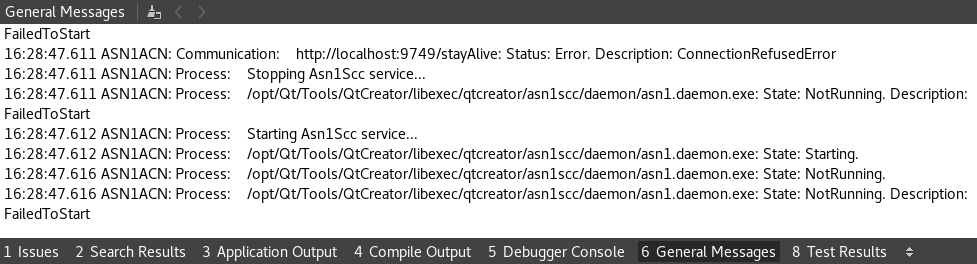

# Troubleshooting

The plugin is strongly bonded with ASN1SCC compiler, as its functionality relies on data produced by the compiler. The plugin and the compiler are two independent beings, and connection between them is performed utilizing client - server architecture. To achieve this, ASN1SCC compiler is being run internally by the plugin, in mode in which it is capable of receiving HTTP requests, and sending back replies. As a result, the correct configuration of ASN1SCC service is needed in order to provide full plugin's functionality.

## How-tos

### How to change service settings?
See [Configuration](configuration.html).

### How to know something is wrong?
The issues with service configuration can be observed inside widgets which present data structures: ASN.1 Types View and Outline. The widgets should show populated tree of a data structures defined inside the project loaded in IDE. If loaded project is valid and contains the data to be shown, but the widgets are still empty (Outline) or contain only project name (ASN.1 Types View), this is a sign of issues in service communication.

### How to get insights of what is happening?
The relevant events connected with service activity are logged in *General Messages* output pane.

### How to open general messages window?
The *General Messages* window can be opened by selecting *Window* -> *Output Panes* -> *General Messages* (default shortcut: `Alt + 6`).

### How to make general messages window less polluted?
It is possible that in case of wrongly configured environment general messages window will be highly polluted with messages about failed requests. To restrain number of the messages, service _watchdog_ can be disabled, or alternatively, stay alive period can be extended.

## Likely issues
<dl>
  <dt>Service process fails to start</dt>
  <dd>Type: <b>PROCESS</b>. State: <b>NotRunning</b>. Description: <b>FailedToStart</b> 
      Provided service path is invalid or user does not have correct access permissions to run service executable.</dd>

  <dt>Connection is refused</dt>
  <dd>Type: <b>COMMUNICATION</b>. Status: <b>Error</b>. Description: <b>ConnectionRefusedError</b> 
      The service process is not running due to invalid service configuration - see issue service process fails to start or port provided as part of <i>Listening URI</i> is invalid or already taken.</dd>
      
  <dt>Host was not found</dt>
  <dd>Type: <b>COMMUNICATION</b>. Status: <b>Error</b>. Description: <b>HostNotFoundError</b> 
      The host name was not found - provided <i>Listening URI</i> is invalid.</dd>
</dl>
